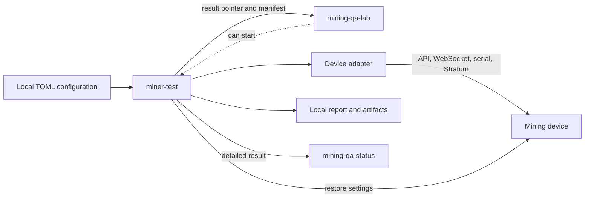

# mining-qa-testcode

`mining-qa-testcode` runs repeatable tests against real Bitcoin mining
devices. Its `miner-test` command connects to a configured device, records
evidence, restores settings after each test, and publishes a detailed result.

## How it works



Tests use common device capabilities instead of model-specific checks. A device
adapter translates its hardware API into those common capabilities.

Current ESP-Miner support includes:

- Bitaxe Bonanza board 1002 with a BZM ASIC;
- Bitaxe Gamma board 602 with a BM1370 ASIC.

## What a run does

For each selected device and test, the runner:

1. checks the device identity and available interfaces;
2. records the starting settings;
3. runs the test while collecting logs and telemetry;
4. restores mutable settings, including after a failure;
5. writes a local HTML report and machine-readable artifacts;
6. publishes enabled remote results.

A test is skipped when the device does not provide a required capability or an
optional validation case was not selected. Skipped tests are shown as neutral
and do not count as failures.

## Quick start

Python 3.11 or newer is required.

```bash
python3 -m venv .venv
. .venv/bin/activate
python3 -m pip install -e .
cp configs/bitaxe-bonanza.example.toml config.local.toml
miner-test --config config.local.toml
```

Edit `config.local.toml` before the run. Keep it untracked because it contains
private device and network information.

Choose one device or test file when needed:

```bash
miner-test --config config.local.toml --device bonanza-lab-1
miner-test --config config.local.toml --pattern 'test_public_pool_smoke.py'
```

A hardware run can change pool settings, restart a device, or install firmware.
Use only an authorized device and configuration.

## Results

Each run creates a timestamped directory below `artifacts/`. It can contain:

- `report.html` and `result.json`;
- runner and test logs;
- normalized device state and telemetry;
- API and serial logs;
- downloaded device logs;
- a bounded manifest for the lab's private backup.

When configured, detailed results and selected private artifacts are always
published to `mining-qa-status`. A `mining-qa-lab` run also receives a small
result pointer and keeps a verified local artifact copy.

## Documentation

- [User guide](docs/USER_GUIDE.md): configure devices, run tests, and understand
  local output.
- [Stratum tests](docs/STRATUM_TESTS.md): run the public-pool smoke test and
  local Stratum V1 regressions.
- [Publishing guide](docs/PUBLISHING.md): configure local, GitHub, and Mining QA
  Status results.
- [Orchestration v1](contracts/orchestration-v1.md) and
  [v2](contracts/orchestration-v2.md): interfaces used by `mining-qa-lab`.
- [Mock device v1](contracts/mock-device-v1.md): loopback-only no-hardware
  component and integration boundary.
- [Specifications](specs/README.md): implementation behavior and feature
  contracts.
- [Agent instructions](AGENTS.md): repository rules for automated contributors.
