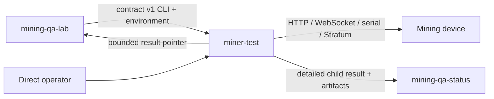

# mining-qa-testcode — overview

## Purpose

`mining-qa-testcode` provides repeatable, evidence-producing tests against real
Bitcoin mining devices. It turns validated local configuration into one
failure-safe hardware-test lifecycle and publishes detailed child results.

The project is one member of the Mining QA family. It does not schedule the
lab: [`mining-qa-lab`](https://github.com/johnny9/mining-qa-lab) invokes
`miner-test` through the versioned
[orchestration contract](../contracts/orchestration-v1.md), while
[`mining-qa-status`](https://github.com/johnny9/mining-qa-status) stores and
presents results.

## Users and dependent systems

- Firmware developers and reviewers needing exact-source hardware evidence.
- Testcode contributors adding devices, transports, tests, and result behavior.
- Lab operators running profiles directly or through `mining-qa-lab`.
- Mining devices exposing HTTP, WebSocket, serial, OTA, and Stratum behavior.
- Mining QA Status receiving sanitized child results and artifacts.

## Main capabilities

- Capability-oriented device adapters and failure-safe lifecycle management.
- Bounded HTTP, WebSocket, serial, OTA, and Stratum interfaces.
- Public-pool observation and local Stratum V1 regression testing.
- Normalized state, telemetry, chart markers, artifacts, privacy, and exact
  source provenance.
- Local, GitHub Check, and Mining QA Status child-result publication.
- Independent verification of orchestrator-supplied testcode repository/SHA.

## Project boundary

### Testcode owns

- TOML loading, test/device selection, discovery, and validation-case opt-in.
- Identify, optionally upgrade, capture baseline, test, restore, collect logs,
  and close interfaces for one invocation.
- Detailed outcomes, telemetry, artifacts, privacy, provenance, and child
  publication.
- The bounded versioned result pointer consumed by a lab assignment.

### Owned by mining-qa-lab

- Trigger trust, gate planning, configuration snapshots, inventory, leases,
  firmware selection, durable scheduling, worker execution, and recovery.
- Selecting an exact testcode SHA and launching `miner-test`.
- Parent-gate aggregation and links to detailed child results.

### Owned elsewhere

- Mining QA Status authentication, durable presentation, GitHub App checks,
  summaries, storage, and webhook ingestion.
- Firmware compilation, mining pools, physical wiring, host security, and
  private device credentials.

## System context

## Cross-project contract

The public boundary is [contracts/orchestration-v1.md](../contracts/orchestration-v1.md).
It defines runner CLI arguments, exit states, bounded environment metadata,
testcode identity verification, and the result-pointer object. The runner does
not import lab modules and the lab does not import runner modules.

Additive v1 fields are compatible. Meaning/type removal or changes require a
new version with coordinated support in both repositories.

## Cross-cutting constraints

- Python 3.11 or newer; device support is capability and adapter driven.
- Mutable state is restored after assertion, setup, and infrastructure errors.
- Secrets remain environment-only and published evidence is sanitized.
- Device writes and OTA retain explicit preconditions and postconditions.
- Network, serial, artifact, and metadata inputs are bounded.
- Local coordinates remain in ignored profiles; HIL evidence is reported
  separately from unit and package checks.

## Developer orientation

- Working rules: [AGENTS.md](../AGENTS.md)
- Setup and commands: [README.md](../README.md)
- Feature directory: [INDEX.md](INDEX.md)
- Outcome navigation: [STORY-MAP.md](STORY-MAP.md)
- Specification maintenance: [MAINTENANCE.md](MAINTENANCE.md)

## Changelog

- 2026-08-10: Split the runner into `mining-qa-testcode`, made
  `mining-qa-lab` an external restricted owner, and established contract v1.
- 2026-08-10: Established the original runner/lab ownership boundary and child
  result protocol.
